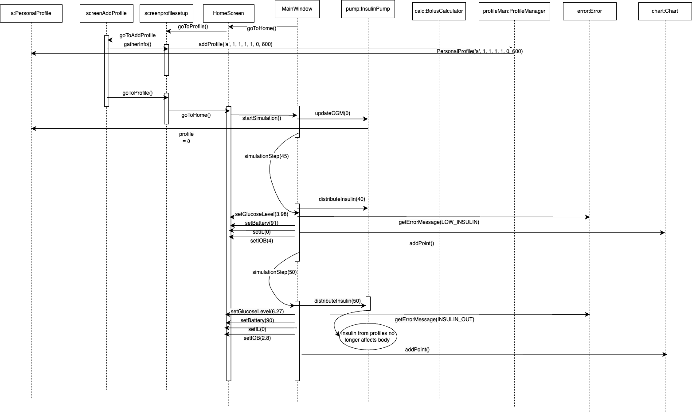

# Tandem t:slim X2 Insulin Pump Simulation

## Introduction
This project is a simulation of the Tandem t:slim X2 Insulin Pump, designed to emulate the functionality of a real insulin pump for educational and testing purposes. The simulation provides a safe environment to explore the features and behavior of the device without the risks associated with real-world usage.

## Features
- Simulates insulin delivery based on user-defined settings.
- Includes a user-friendly interface for configuring basal rates, bolus doses, and other parameters.
- Tracks insulin usage and provides alerts for low insulin levels or other critical conditions.
- Implements safety checks to prevent incorrect configurations.
- Logs activity for review and analysis.

## Requirements
- C++ 11 or higher
- QT Creator

## Installation
1. Clone the repository:
    ```bash
    git clone https://github.com/KassemT76/COMP3004Team58Project
    ```
2. Navigate to the project directory:
    ```bash
    cd src
    ```
3. Install dependencies:
    ```bash
    sudo apt install libqt5charts5-dev
    ```

## Usage
1. Run the simulation, by opening it up in QT creator
2. Follow the on-screen instructions to configure and operate the simulated insulin pump.

<table>
  <tr>
    <th>Success Scenario 1</th><th>Success Scenario 2</th>
  </tr>
  <tr>
    <th></th><th></th>
  </tr>
  <tr>
    <th>Emergency Scenario 1</th><th>Emergency Scenario 2</th>
  </tr>
  <tr>
    <th></th><th></th>
  </tr>
</table>

## Disclaimer
This simulation is for educational purposes only and should not be used for medical decision-making or as a substitute for a real insulin pump.

## Notes
The document for the project can be found in the docs folder.

## Credits
[Ariz Kazani](https://github.com/Ariz-Kazani) Designed and implemented the backend insuline pump functions and state machine diagrams. 

[Hollen Lo](https://github.com/hollen789) Designed and implemented profiles and related GUI components. Designed Sequence Diagrams.

[Kassem Taha](https://github.com/KassemT76) Designed and implemented the majority of the GUI and the UML class diagram. 

[Niharika Ramireddy](https://github.com/niharikaramireddy) Made the use case diagram and tracability matrix.